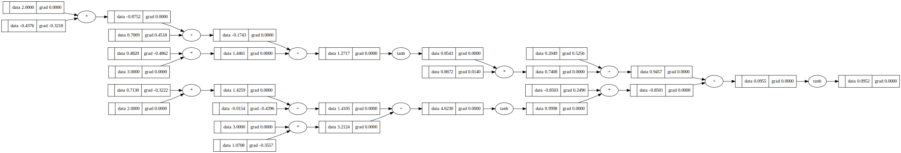

# MLP-from-Scratch: A Tiny Autograd Engine + Neural Network in Pure Python

[](https://colab.research.google.com/github/Pulkiiit/MLP-from-scratch/blob/main/NN_from_scratch.ipynb)

This project is a fully functional neural network (Multi-Layer Perceptron) implemented from scratch in Python — no libraries like PyTorch or TensorFlow are used for the core logic.

## Key features
- Custom scalar Value class that supports reverse-mode autodiff
- Operator overloading (+, *, tanh, etc.) for intuitive graph building
- Full backpropagation with topological sorting
- Modular neural network design: Neuron, Layer, and MLP classes
- Training using manual gradient descent
- Loss tracking + visualizations with matplotlib

## Architecture Example
A 3-4-4-1 MLP trained on a small synthetic dataset.

## Working 
- Autograd Engine: Every computation node is a Value, which stores .data, .grad, and _backward() closure.
- Computational Graph: Built dynamically through Python operators.
- Backpropagation: Called via loss.backward() to fill in all .grad fields.
- Manual Training Loop: Forward pass → loss → backward → weight update.

## Sample Computation Graph

## Loss Curve

## Dependencies
- Python 3.7+
- matplotlib
- graphviz

```bash
pip install matplotlib graphviz
```
